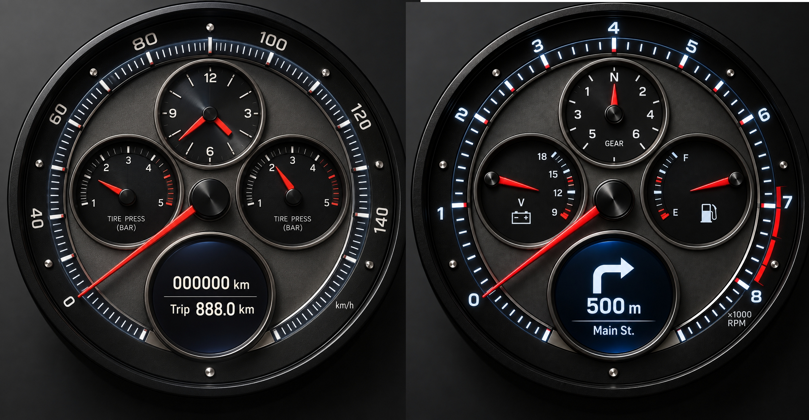
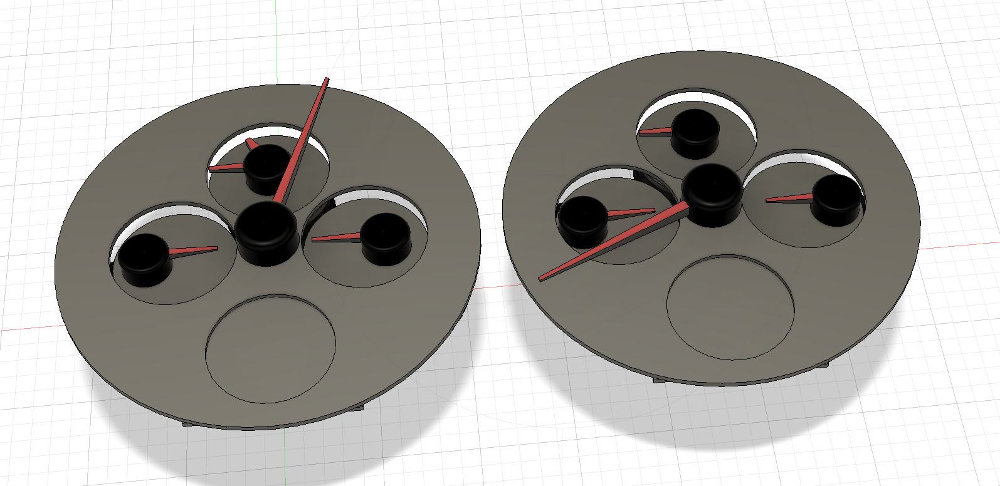
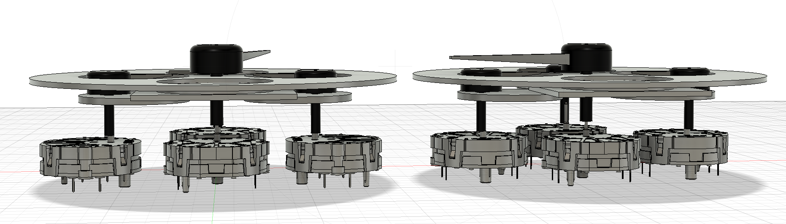
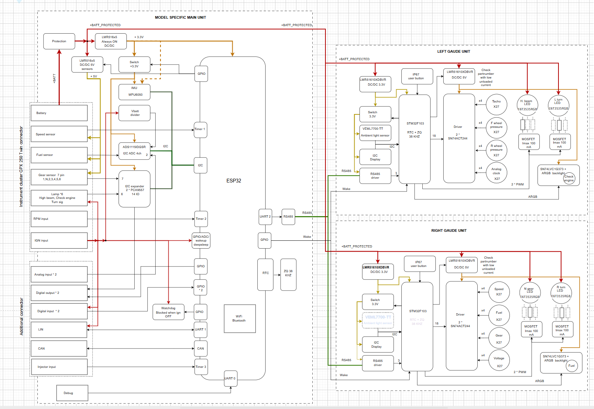

# SmartMoto Dashboard

**An analogue soul. A digital brain.**

A custom instrument cluster for the **GPX 250 Twin**, developed by **Sergei Kuzmin**. Real needles, round displays and programmable electronics, with the character of a chronograph.

[Project website & development log](https://dashboard.smartmoto.asia/) · [Original GPX workshop notes](https://gpx.smartmoto.asia/diy-instrument-panel/) · [Stock-cluster investigation](https://gpx.smartmoto.asia/instrument-cluster/)

This is the hardware, mechanical and firmware **project repository**. The website is maintained separately.

## Current status

Early development: mechanical layout and electronics architecture. This initial repository contains the project description, design images and a folder structure for future source files. Schematics, PCB layouts, native CAD files and project firmware have not been published here yet.



*Dial design render · First exterior concept. Errors in this render were introduced by AI. Scales, labels and display graphics are still being developed.*

## Why build my own?

The stock GPX panel gave me four reasons to start again:

- Poor visibility in direct sunlight.
- Speed digits that flicker between neighbouring values.
- A fuel gauge that takes too long to read.
- A speedometer that reads 10–15% too high.

These are my observations from riding with the stock cluster. This project is my attempt to solve them.

## Two instruments

The main riding information belongs on the needles. The round LCDs make room for additional information and a configurable interface. Each instrument is planned around four gauge motors, with smaller dials inside the main scale.

| Left instrument in the render | Right instrument in the render |
| --- | --- |
| Speedometer | Tachometer |
| Clock | Voltmeter |
| Front tyre pressure | Fuel level |
| Rear tyre pressure | Selected gear |

The first electronics block diagram places the speedometer and tachometer on opposite sides compared with the exterior render. This detail is still being reconciled; neither image is a final manufacturing reference.

## Development log — 20 September 2026

Today I got the first results of the instrument-panel design.

The gauge motors and needles arrived from AliExpress. I checked that the motors worked using an Arduino and a simple sketch. I carefully measured everything, created 3D models and put together the first layout based on the actual parts in Autodesk Fusion. I also made a render of the exterior and the first version of the electronics block diagram.

### Mechanical layout



*Dial plates, needles and display openings, arranged around the measured components.*



*Under the dial plates: gauge motors, shafts and needle clearances.*

Earlier CAD studies are preserved in [docs/images/early-studies](docs/images/early-studies/). These are screenshots, not editable CAD sources.

## Electronics architecture

### Two identical instrument modules

I’m planning two identical modules based on the **STM32F103**. Each will contain:

- Four gauge motors.
- A display.
- A real-time clock (RTC).
- An ambient light sensor.
- Its own voltage regulators.
- Two bright indicator lamps built around high-power LEDs.
- An RS-485 interface for communication with the main unit.

### Main unit

The **ESP32-based main unit** will contain:

- The interface to the motorcycle.
- Power-supply protection circuits.
- An RS-485 interface to the instruments.
- An inertial measurement unit (IMU).
- An external watchdog.
- BLE for the connection to the phone.
- Wi-Fi connectivity.

The ESP32 will handle the application logic and generate display content, while the instrument modules control their local hardware. The intended development environment is the **Arduino framework with PlatformIO**.

[](docs/images/electronics-block-diagram.png)

*Proposed architecture, first version. Open the image for the full-size diagram. Hardware and firmware are still being developed.*

## Further down the road

These are features I want to explore, not working functions yet:

- **Fuel consumption and range:** estimate consumption from injector pulse durations, combined with refuelling records from my AI assistant.
- **Bike meets home:** send motorcycle condition and route data to my home server.
- **Weather along the way:** explore rain forecasts along a navigation route and route planning that accounts for refuelling.
- **Phone notifications:** show incoming calls and message notifications on the instrument displays.

Next comes refining the mechanical layout, electronics and power management, including keeping the clock running with the ignition off.

## Repository structure

```text
docs/
  images/                  Current render, Fusion views and block diagram
    early-studies/         Earlier CAD screenshots
hardware/
  main-unit/               Future ESP32 schematics, PCB and BOM
  instrument-module/       Future common STM32F103 module design
mechanical/
  cad/                     Future native CAD and interchange files
firmware/
  main-unit/               Future ESP32 firmware
  instrument-module/       Future STM32F103 firmware
  examples/                Future standalone bring-up sketches
```

The source folders currently contain scope notes. No build or fabrication instructions are available yet.

## Source release

I intend to develop this as an open-source project and publish the design sources and Arduino-based firmware as they mature. A license has not yet been selected for this initial documentation release.

## Author

**Sergei Kuzmin** — [GPX workshop](https://gpx.smartmoto.asia/) · [SmartMoto.Asia](https://smartmoto.asia/) · [DOGS²](https://dogs2.smartmoto.asia/)
