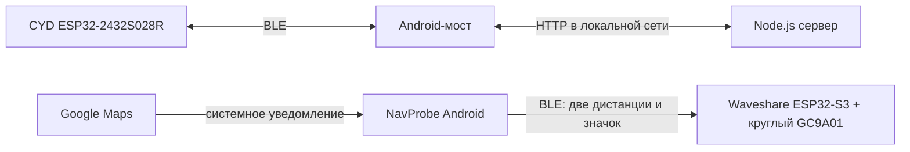

# BLE, Google Maps и круглые дисплеи — сохранённый стенд

Этот раздел хранит **копии исходников на 23 сентября 2026 года**. Они лежат в `source/` с прежними относительными путями: сервер `ble-internet-demo/server/server.mjs` импортирует `cyd-companion-v2/server/telemetry.mjs`, поэтому оба проекта нужны вместе. `SOURCE_SHA256.txt` перечисляет SHA-256 каждого скопированного файла. Для обновления копий из исходной рабочей папки используется [import-workspace.ps1](import-workspace.ps1); скрипт копирует только названные исходники и не удаляет существующие файлы.

## Что здесь находится

| Путь | Назначение |
| --- | --- |
| [source/cyd-companion-v2/android](source/cyd-companion-v2/android) | Android-мост `demo.cyd.companion`: CompanionDeviceManager, PendingIntent BLE-сканирование, подключение к CYD; отдельный диагност `demo.cyd.diagnostics`; NavProbe `demo.cyd.navprobe`, который читает уведомление Google Maps и передаёт его на круглый дисплей. |
| [source/ble-internet-demo/firmware](source/ble-internet-demo/firmware) | Прошивка ESP32-2432S028R (CYD): BLE, экран, кнопки и обмен с Android-мостом. |
| [source/ble-internet-demo/server](source/ble-internet-demo/server) и [source/cyd-companion-v2/server](source/cyd-companion-v2/server) | Локальный HTTP-сервер, API и диагностическая страница для моста. |
| [source/waveshare-round-display](source/waveshare-round-display) | Прошивка Waveshare ESP32-S3-LCD-1.47B с внешним круглым GC9A01 240×240: одометр и навигация через собственный BLE GATT-сервис. |
| [source/ble-internet-demo/android](source/ble-internet-demo/android) | Исходный Android BLE-демонстратор, сохранённый как этап разработки. |
| [source/nano-round-display](source/nano-round-display) | Более ранний прототип круглого дисплея для Arduino Nano; не используется в текущей BLE-схеме. |

## Как части связаны

Это **два независимых BLE-соединения**. CYD обнаруживается и обслуживается мостом; Waveshare получает навигацию от NavProbe. Сервер не нужен для передачи Maps → Waveshare. Отсутствие новых уведомлений не останавливает чередование экранов: плата показывает последние принятые данные, пока не получит очистку или не разорвётся BLE.

## Инструкции и границы проверки

- [BUILD.md](BUILD.md) — подготовка окружения, только ранее проверенные команды сборки и загрузки.
- [HARDWARE.md](HARDWARE.md) — платы, подключение, порты и что проверять перед прошивкой.
- [PROTOCOL.md](PROTOCOL.md) — источники навигационных данных, BLE-пакеты и условия очистки.
- [STATUS.md](STATUS.md) — подтверждённые результаты и то, что остаётся неизвестным.
- [AGENTS.md](AGENTS.md) — правила для продолжения работ: без ADB и без подмены аппаратных результатов локальной сборкой.
- Исторические документы: [HANDOFF](source/cyd-companion-v2/HANDOFF.md), [ARCHITECTURE](source/cyd-companion-v2/ARCHITECTURE.md), [VALIDATION](source/cyd-companion-v2/VALIDATION.md).

В публичный репозиторий намеренно не скопированы `local.properties`, `.env`, серверные `data/`, телефонные журналы, локальные резервные копии flash, кэши сборки и APK/бинарные образы. Последние опубликованные версии и их хеши перечислены в [STATUS.md](STATUS.md); исходники и инструкции доступны без этих артефактов. Лицензия этого репозитория пока не выбрана; наличие исходников здесь само по себе не задаёт условий использования.
