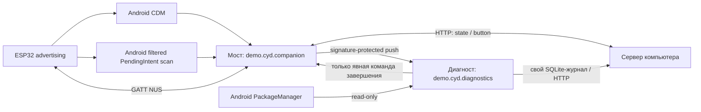

# CYD: два приложения, Android 13+

## Граница доказанного

Эта реализация опирается на публичные Android API и прочитанные исходники AOSP Android 13. Компиляция, Lint и локальные тесты не подтверждают поведение конкретной прошивки Xiaomi. Работа двух новых APK на телефоне ещё не проверена. Гарантии «100%/110%», срок доставки BLE-события и обещание обхода ограничений OEM не даются.

## Компоненты

У APK разные package/UID/процессы/базы. Они подписываются одним сертификатом. Командный приёмник моста и приёмник копий событий защищены собственным разрешением уровня signature. Общий Java-код журналирования компилируется в каждый APK, общей памяти нет.

### Мост

- Системный выбор устройства создаёт CDM association. Bluetooth bond — отдельная системная операция `createBond()`, успех определяется состоянием Android, не нажатием кнопки.
- Включение наблюдения вызывает `startObservingDevicePresence(address)` без предварительного `stopObserving`. Дополнительно регистрируется один стабильный, явный, mutable PendingIntent со скан-фильтром MAC, ALL_MATCHES, BALANCED и reportDelay 3000 мс. Это два источника событий, но они используют общий Bluetooth-стек телефона.
- `CDM_APPEARED` и `PI_SCAN` записываются раздельно. На API 33 callback CDM не различает нахождение рядом и уже существующее соединение. PI_SCAN содержит возраст последнего результата и RSSI; пакеты старше 15 секунд не инициируют соединение. Это порог реализации, не обещание времени обнаружения.
- CDM association сохраняется Android. BOOT_COMPLETED / обновление APK / Bluetooth ON восстанавливают наблюдение и скан, но сами не соединяют GATT. До первой разблокировки поддержка не заявлена: приложение не direct-boot-aware.
- Единственный connectedDevice foreground service владеет GATT на главном потоке. Повторные wake объединяются. Callback проверяет экземпляр GATT, HTTP-результат — поколение соединения. Тайм-ауты операций и ограниченные повторы предотвращают бесконечное зависание одной попытки.
- START_NOT_STICKY выбран намеренно: новый запрос соединения должен иметь записанный источник. У моста нет задания загрузки журналов JobScheduler: оно само могло бы перезапустить процесс и исказить проверку BLE-пробуждения. Передача диагностических данных возложена на второй APK.
- Протокол ESP32 и существующие серверные данные сохранены. Окно не запускается автоматически: связь работает в сервисе, окно открывается через уведомление.

### Независимый диагност

- С версии 2.0.2 диагност при открытии окна начинает foreground-сеанс обмена с компьютером до одного часа. Он отправляет отдельный heartbeat и принимает только пассивную команду REPORT. Сервер показывает возраст последнего ответа, pending/completed/expired команды; отсутствие heartbeat не считается доказательством смерти процесса моста. Сеанс не стартует автоматически из BOOT и не вызывает компоненты моста. Регулярность опроса не является гарантией доставки Android при сне/сетевых ограничениях.
- Команды ставятся только с loopback компьютера. Очередь сохраняется отдельно от телеметрии, команда истекает через 120 секунд. REPORT_SAVED подтверждает создание записи; поступление самой записи и uploadAck проверяются отдельно. Повторный запрос после обрыва связи идемпотентен по ID, но сбой между записью отчёта и сохранением ID может создать повторный пассивный отчёт с тем же commandId. Исторический CDM-снимок остаётся историческим.
- Тип foreground service: dataSync, запуск из видимой Activity, остановка по собственному часовому сроку и `onTimeout` Android. [Официальные ограничения времени dataSync](https://developer.android.com/develop/background-work/services/fgs/timeout). На Xiaomi работа новой версии ещё требует проверки.

- Мост сначала фиксирует событие в SQLite, затем отправляет явный broadcast диагносту. Диагност атомарно сохраняет копию и ключ дедупликации в своей базе. Обычный просмотр читает только эту базу. ContentProvider, опроса сервиса моста и bindService нет.
- Диагност отправляет собственную последовательность событий на `/api/v2/events`: при работающем процессе с задержкой объединения и через сохраняемый JobScheduler при последующем запуске системой. Недоставленные записи не удаляются. Сервер подтверждает точный номер последнего события пакета; повторы не создают дубликаты. Доставка зависит от доступности сети и разрешённой Android фоновой работы.
- Сервер хранит до 20 000 последних событий на установку (до 8 установок). Диагност оставляет 3000 подтверждённых событий и все неподтверждённые. Мост хранит локальный архив; в этой диагностической версии он не ограничен по объёму. Это локальное демо, не круглосуточная промышленная система сбора.
- Кнопки SNAPSHOT / ARCHIVE явно запускают компонент моста. Они маркируются как вмешательство и не предназначены для наблюдения за самостоятельным пробуждением.

### Подтверждение завершения

1. Диагност отправляет защищённую явную команду TERMINATE. Команда способна создать процесс отсутствующего моста; это записывается как DIAGNOSTIC_COMMAND, а не BLE.
2. Мост возвращает Binder-токен процесса, PID, UUID процесса и ResultReceiver подтверждения.
3. Диагност подписывается `linkToDeath` без связывания с Android Service и подтверждает подписку.
4. Мост фиксирует TERMINATION_COMMIT и ждёт ordered-broadcast подтверждения, что диагност сохранил запись.
5. Мост вызывает `Process.killProcess(myPid())`. Диагност записывает BRIDGE_PROCESS_DIED только в DeathRecipient. Неполный handshake не считается успехом; мост не завершается по тайм-ауту подтверждения.

Это завершение процесса, а не force-stop пакета и не точное воспроизведение всего LMK. Новое событие CDM при включённой плате не доказывает физическое выключение/включение питания.

## Системный статус — источники не смешиваются

Наблюдатель самостоятельно читает PackageManager: установленный пакет/версию, `ApplicationInfo.FLAG_STOPPED`, enabled/suspended, разрешения Bluetooth/companion и объявленный сервис CDM. Это не требует запуска моста. FLAG_STOPPED не показывает, существует ли сейчас процесс.

`CompanionDeviceManager.getMyAssociations()` возвращает только привязки вызывающего приложения. В AOSP 13 методы чужих привязок проверяют полномочия; системное разрешение MANAGE_COMPANION_DEVICES наши APK не получают. Поэтому мост читает **свои системные** association ID/MAC и передаёт снимок с временем чтения. Диагност помечает его как снимок, не как своё текущее чтение CDM.

`AssociationInfo.toString()` передаётся без интерпретации как исходный диагностический текст. Его формат не является стабильным API чтения флага наблюдения. Собственная настройка enabled и успешный возврат startObserving не выдаются за текущий системный флаг. Закрытые системные логи CDM, внутренние результаты его сканера и OEM-настройка автозапуска недоступны через использованные публичные API. ADB, root, hidden API и reflection не используются.

## Журнал и интерпретация

Каждая запись: номер последовательности, UTC, elapsedRealtime, BOOT_COUNT, PID, UUID процесса, первый записанный компонент, source/type/detail, адрес платы. У диагноста есть как время получения копии, так и исходные время/процесс моста. PID сам по себе не идентификатор запуска.

Сервер разделяет факт доставки события, создание процесса, ручной запуск, подписку GATT и передачу ответа. Отсутствие записи не объясняет причину. Старые события предыдущей загрузки не подтверждают новую. Журнал не измеряет питание платы. Кнопки пользователя, запросы диагноста и системные события имеют разные источники.

## Проверенные первичные источники

- [Android: BLE в фоне](https://developer.android.com/develop/connectivity/bluetooth/ble/background) — CDM и PendingIntent для отсутствующего процесса; ограничения фоновой работы сохраняются.
- [CompanionDeviceManager](https://developer.android.com/reference/android/companion/CompanionDeviceManager) — область getMyAssociations, observe API, связь association и bonding.
- [CompanionDeviceService](https://developer.android.com/reference/android/companion/CompanionDeviceService) — значение callback API 33.
- [BluetoothLeScanner](https://developer.android.com/reference/android/bluetooth/le/BluetoothLeScanner) и [официальный sample PendingIntent](https://github.com/android/platform-samples/blob/main/samples/connectivity/bluetooth/ble/src/main/java/com/example/platform/connectivity/bluetooth/ble/BLEScanIntentSample.kt).
- [FGS: ограничения и companion-исключение](https://developer.android.com/develop/background-work/services/fgs/restrictions-bg-start).
- [Ограничения фоновой работы](https://developer.android.com/topic/performance/background-optimization) — значение foreground-снимка backgroundRestricted нельзя переносить на все прежние состояния.
- [Жизненный цикл процессов](https://developer.android.com/guide/components/activities/process-lifecycle), [FLAG_STOPPED](https://developer.android.com/reference/android/content/pm/ApplicationInfo#FLAG_STOPPED), [дополнительные изменения force-stop Android 15](https://developer.android.com/about/versions/15/behavior-changes-all#stopped-state). Изменения Android 15 не приписываются телефону с Android 13.
- [IBinder.linkToDeath](https://developer.android.com/reference/android/os/IBinder), [ResultReceiver](https://developer.android.com/reference/android/os/ResultReceiver), [Process.killProcess](https://developer.android.com/reference/android/os/Process).
- [Xiaomi: политика автозапуска](https://dev.mi.com/xiaomihyperos/documentation/detail?pId=1624) — существование OEM-политики, не доказательство причины сбоя конкретного аппарата.
- [AOSP Android 13: companion service](https://android.googlesource.com/platform/frameworks/base/+/refs/heads/android13-release/services/companion/java/com/android/server/companion/). Прочитанные файлы сохранены в research/: PersistentDataStore (сохранение notify_device_nearby), CompanionDeviceManagerService (загрузка/проверка полномочий), BleCompanionDeviceScanner (MAC-фильтры/задержка потери), CompanionDevicePresenceMonitor (объединение BLE/BT-источников). AOSP не объявляется исходниками прошивки Xiaomi.

## Эксплуатационные границы

Локальный сервер слушает LAN, не имеет пользовательской аутентификации и не предназначен для открытого Интернета. HTTP оставлен для существующего локального стенда. MAC, модель, журналы и идентификаторы процессов передаются только на настроенный адрес. Старый APK не удаляется, его BLE-мост надо отключить, чтобы он не занимал плату.
